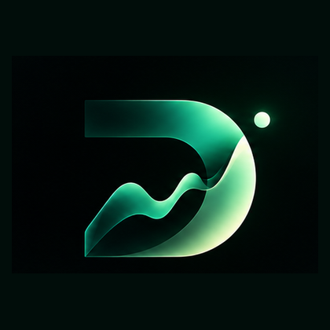

<p align="center">
  
</p>

<h1 align="center">Drift</h1>

<p align="center"><strong>See what changed. Know why it matters.</strong></p>

<p align="center">
  A calmer, explainable market watchlist that helps investors focus on meaningful change instead of scanning every ticker.
</p>

<p align="center">
  <a href="https://frontend-dusky-omega-11.vercel.app">Live demo</a> ·
  <a href="https://github.com/airasalish/drift">Source code</a>
</p>

---

## Why Drift exists

Most watchlists show movement, but they leave the important work to the investor: deciding whether the movement is normal, meaningful, or worth investigating. Drift handles that first layer of context. It remembers the user’s last real visit, evaluates each stock against its own behavior, and surfaces only the changes that deserve attention.

The product is deliberately **rule-based and explainable**. Drift does not pretend that an opaque model knows what an investor should buy or sell. Every surfaced item has visible evidence behind it.

## What you can do

| Capability | What it provides |
|---|---|
| **Build watchlists** | Start from scratch or create a curated premade list for Technology, Banking, Pharma, EVs, and other themes. |
| **Search and add symbols** | Find a company by name or ticker, verify the result, and add it to one or more watchlists. |
| **See what changed** | Surface meaningful movement since the user’s last visit rather than showing an undifferentiated stream of prices. |
| **Use personal baselines** | Store the price and time of a real review so the next comparison starts from where the user actually was. |
| **Understand the evidence** | Show rule-level reasons such as unusual movement, volume spikes, 52-week levels, and portfolio-level movement. |
| **Explore charts** | Review 1M, 3M, 6M, 1Y, or all available history using candlesticks or a line chart, with volume and hover inspection. |
| **Review history** | See what Drift has surfaced over time. |
| **Switch explanation level** | Beginner mode simplifies the wording without changing the data or signal. |
| **Ask Drifty AI** | Optionally turn computed signals into a short plain-English summary. The AI does not decide what gets flagged. |
| **Keep context across sessions** | Account-backed watchlists and last-view state follow the user across devices. |

## How Drift decides what matters

A stock can enter the attention feed when one or more transparent rules fire:

1. **Abnormal movement:** the move is large compared with that stock’s own trailing behavior.
2. **Unusual volume:** current volume is significantly above its recent average.
3. **52-week context:** the stock crosses, or approaches, a 52-week high or low.
4. **Portfolio context:** several stocks in the watchlist move together.
5. **Market context:** the stock behaves meaningfully differently from the benchmark.

Each rule contributes to an attention score and produces a readable reason. The product is not trying to predict the future; it is helping the user decide what deserves a closer look now.

## Product flow

1. Answer two lightweight onboarding questions.
2. Enter the demo or create an account.
3. Start with a premade watchlist or create one from scratch.
4. Search for and add symbols such as `NFLX`, `DIS`, or `UBER`.
5. Return to the Overview to see market context, refresh status, quiet movement, and attention items.
6. Open a stock to inspect its reasons, chart, thesis, and actions.
7. Mark it as seen so the next comparison uses the user’s own last-view baseline.
8. Use Charts, History, Beginner mode, and Drifty AI when more context is useful.

## Quick start

### Live demo

Open the [Drift live demo](https://frontend-dusky-omega-11.vercel.app) and select **Try the demo**. The demo account provides a zero-setup way to explore the product with seeded data.

### Run locally

#### 1. Start the backend

Drift uses Python 3.11+, FastAPI, SQLAlchemy, and SQLite by default. PostgreSQL can be supplied through `DATABASE_URL`.

```bash
cd backend
python -m venv .venv

# macOS / Linux
source .venv/bin/activate

# Windows PowerShell
.venv\\Scripts\\Activate.ps1

pip install -r requirements.txt
uvicorn app.main:app --reload --port 8000
```

The backend runs at `http://127.0.0.1:8000`. SQLite creates `watchlist.db` automatically on first run.

#### 2. Start the frontend

In a second terminal:

```bash
cd frontend
cp .env.example .env
npm install
npm run dev
```

Open `http://localhost:5173`. The default frontend configuration points to the local backend through `VITE_API_BASE=http://127.0.0.1:8000`.

### Optional Drifty AI configuration

The product works without an AI key. To enable the optional plain-English summary, set one or more comma-separated `GROQ_API_KEYS` values in `backend/.env`. This feature only rephrases signals that the deterministic rule engine has already computed.

## Architecture

```text
React + Vite
     │
     │ polls for watchlist state
     ▼
FastAPI + SQLAlchemy ─── SQLite or PostgreSQL
     │
     │ background polling and shared symbol cache
     ▼
  yfinance market data
```

The API does not call the market-data provider on every user request. A background poller refreshes symbols on an interval and stores the latest quote data in a shared cache. User requests read that cache, which avoids fetching the same symbol separately for every user.

The change-detection layer is kept separate from the market-data source and the presentation layer. That makes the core decision logic easier to test, audit, and extend.

## Project structure

```text
backend/
  app/
    routers/          API routes for auth, watchlists, charts, and history
    services/         market data, change detection, and optional summaries
    models.py         database models
  tests/              backend behavior and rule tests
frontend/
  src/
    components/       dashboard, charts, drawers, watchlists, and navigation
    pages/             landing page and authentication screens
    hooks/             watchlist data and refresh behavior
  public/              Drift logo and product artwork
PROJECT_BRIEF.md       product specification and rule rationale
ENGINEERING_DECISIONS.md architecture and scope decisions
SUBMISSION_NOTES.md    product pitch and demo notes
DEMO_VOICEOVER.md      start-to-finish demo narration
```

## Testing and validation

The frontend is validated with:

```bash
cd frontend
npm run build
```

The backend test suite covers change detection, market data behavior, authentication, watchlist CRUD, templates, charts, history, and related-stock features.

## Important scope choice

Drift is a watchlist and attention tool, not a broker. It does not place trades or tell users what to buy. It helps investors understand what changed and decide what to investigate next.

## Links

- [Live demo](https://frontend-dusky-omega-11.vercel.app)
- [GitHub repository](https://github.com/airasalish/drift)
- [Product brief](PROJECT_BRIEF.md)
- [Engineering decisions](ENGINEERING_DECISIONS.md)
- [Submission notes](SUBMISSION_NOTES.md)
- [Demo voiceover](DEMO_VOICEOVER.md)

## License

This project is provided for demonstration and evaluation purposes.
